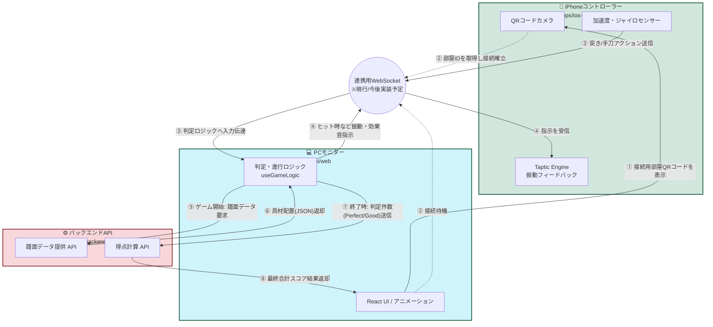

# 🔄 システムデータフロー

このドキュメントでは、本プロジェクト（HappyHappyKarateSoup）を構成する3つの主要コンポーネント（PCモニター、iPhoneコントローラー、バックエンドサーバー）の間で、**どのようなデータが、どのような順序でやり取りされるか**を解説します。

リポジトリの現在の構成（`apps/web`, `apps/ios-controller`, `services/backend`）に基づいた全体像です。

## 1. コンポーネント間のデータフロー図

---

## 2. データの流れと該当ファイル（ユースケース別ステップ）

新しく開発に参加する方がコードを追いやすいよう、処理ごとに対応する**具体的なファイルパス**を添えて解説します。

### 🔗 ステップ1: デバイスのペアリング (接続)
1. **PC (Web)**: `apps/web/src/pages/Connect.tsx`
   * 接続待機画面に、一意の部屋IDを含んだQRコードが表示されます。
2. **iPhone (iOS)**: `apps/ios-controller/QRCodeReader/` 配下のコード
   * iPhoneのカメラでQRを読み取り、双方向通信用の WebSocket（またはリアルタイムデータベース等）に接続要求を送ります。
3. 接続処理が完了すると、PCモニター側はiPhoneを受け入れ、ゲーム画面へと遷移します。

### 🎮 ステップ2: ゲーム機能の初期化
4. **PC (Web)**: `apps/web/src/pages/Game/useGameLogic.ts`
   * ゲームロジックが、**バックエンド (Java)** の Chart API にリクエストを送ります。
5. **バックエンド**: `services/backend/src/main/java/.../chart/ChartController.java` 等
   * ステージに応じた「譜面データJSON（例: `services/backend/src/main/resources/charts/soup_beginner_01.json`）」を取得して返却します。*(※現在はWeb側でテスト用として `apps/web/src/testdatas/charData-demo.json` を静的に読み込む実装にもなっています)*
6. **PC (Web)**: `apps/web/src/pages/Game/Game.tsx`
   * 取得した譜面データに基づき、画面上部の奥から具材が降ってくる描画アニメーションが開始されます。

### 🥋 ステップ3: プレイ中（リアルタイム通信）
7. **iPhone (iOS)**: `apps/ios-controller/PunchAction/` または `ChopAction/`
   * ユーザーが iPhone を握って前に突き出すと、センサー処理が動きを検出し、即座にシグナル（アクション種類とタイムスタンプ）をPCへ送信します。
8. **PC (Web)**: `apps/web/src/pages/Game/useGameLogic.ts`
   * 受け取ったシグナルを利用して、「どの具材がどのタイミングで判定ゾーンにいたか」を計算し、`Perfect` / `Good` / `Miss` の判定を内部ステートに保存します。
9. **連動フィードバック**: 大きなヒットなどが発生した場合、PC側からiPhoneへ「振動させて！」という信号を送り返し、iOS側のTaptic Engineを稼働させ手に感触を伝えます。

### 📊 ステップ4: リザルト（得点計算）
10. **PC (Web)**: `apps/web/src/pages/Game/useGameLogic.ts` -> 終了判定
    * 曲と譜面が終了すると、Web側で集計した判定の総数（Perfectが10回、Goodが5回…など）を送信します。
11. **バックエンド**: `services/backend/src/main/java/.../score/ScoreCalculationController.java` & `ScoreCalculationService.java`
    * `/api/scores/calculate` エンドポイントがリクエストを受信します。
    * 受信した判定数に配点ルール（例: Perfect=100点）を掛けて合計スコアを算出しレスポンスとして返します（DBには保存せず計算機能のみを提供します）。
12. **PC (Web)**: `apps/web/src/pages/Result.tsx`
    * 返ってきた合計得点などを受け取り、最終的なリザルト画面として表示します。

---

このデータフローを頭に入れておくことで、新機能（例：新しいアクションの追加や、新しいスコア評価の実装など）を作成した際に、「iOS」「Web」「Java API」のどこを修正し、どうデータを橋渡しすれば良いかがわかります。
