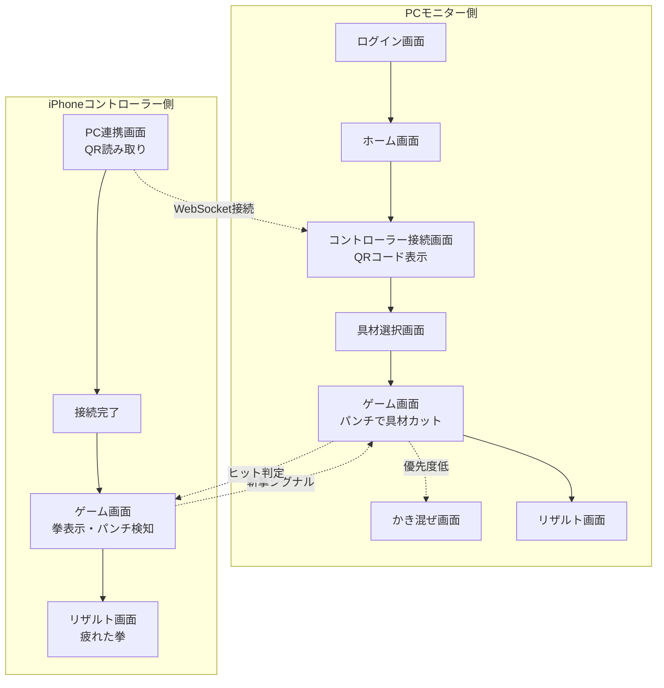

# 🗺️ 概観ドキュメント (Overview)

## 1. 全体テーマ・世界観
* **コンセプト:** Wiiなどの体感型テレビゲームの感覚をWebとスマホで再現する「空手 × 料理」アクション。
* **プレイスタイル:** PCをモニター（画面）として置き、iPhoneをコントローラー（Wiiリモコン）として手に持つ。
* **体験のコア:** 画面の動きに合わせてiPhoneを前に突き出す（パンチする）ことで具材を粉砕する爽快感と、完成した謎のスープによるハッピーな体験。

## 2. システム構成の基本
* **PC側:** 描画・メインロジック・BGM・AIコメント生成を担当（Webアプリ）。
* **iPhone側:** センサー入力（加速度・ジャイロ）・触覚フィードバック（Taptic Engine）・効果音を担当（iOSネイティブアプリ）。
* **通信:** WebSocketサーバーを介して、両者をリアルタイム（低遅延）で同期する。

## 3. 画面遷移図（フロー）

